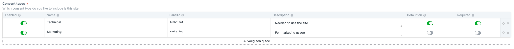

# Craft Cookie consent plugin for Craft CMS 3.x
Allow your visitors to set there cookie preference which you can use to enable features in your site.
Create your own cookie groups, make them required and/or set there default state.
These cookie groups can contain cookies with information which you can display to describe the purpos of each cookie.



The default modal contains the following features:
- Default responsive modal
- Position (top-left, top-right, bottom-left, bottom-right)
- Auto accept and close after x seconds (optional)
- Block site usage without consents
- Display settings (yes/no)

Modal with settings:


Modal settings:


Modal without settings:


## Requirements
This plugin requires Craft CMS 3.0.0-beta.23 or later.

## Installation

To install the plugin, follow these instructions.

1. Open your terminal and go to your Craft project:

        cd /path/to/project

2. Then tell Composer to load the plugin:

        composer require https://github.com/dutchheight/craft-cookie-consent

3. In the Control Panel, go to Settings → Plugins and click the “Install” button for Craft Cookie consent.

4. Add `{{ craft.craftCookieConsent.askConsent() }}` on the page(s) which should display the modal.

## Using Craft Cookie consent
### Display the consent modal
`craft.craftCookieConsent.askConsent(options, force)` is used to display the default consent modal.

| Attribute | Type | Required | Description |
|:----------|:-----|:---------|:------------|
|options|object|false|Accepts `position` ('`top` or `bottom`-`left` or `right`')|
|force|boolean|false|Force the modal|

#### Examples
Display the modal
```craft.craftCookieConsent.getConsents()```

Display the modal in the top right corner
```craft.craftCookieConsent.getConsents({'position': 'top-right'})```

Display the modal always:
```
{{ craft.craftCookieConsent.getConsents({}, true) }}
```
---

## Display cookie descriptions
Display's a table with all enabled cookies. The table has `#cookie-descriptions` as id.
Eache cookie is provided with the class `.consent-true` or `.consent-false` depending on the consentgroup's consent.
All cookies are grouped by there group which has the class `.cookie-descriptions-group-title`. If you like more control you can use `craft.craftCookieConsent.getCookiesRaw()`.

#### Examples
Display a table with all enabled cookies
```
{{ craft.craftCookieConsent.getCookies() }}
```
---

## Get all visitor consents
`craft.craftCookieConsent.getConsents(defaultConcentIfNotSet)` is used to get an array with the visitors consents.

| Attribute | Type | Required | Description |
|:----------|:-----|:---------|:------------|
|defaultConcentIfNotSet|boolean|false|return the default consents if the visitor doens't have any consents|

#### Examples
Get all consents of the current visitor
``craft.craftCookieConsent.getConsents()``

Get all consents of the current visitor. Get default values if noting found.
```craft.craftCookieConsent.getConsents(true)```

---

## Get consent by handle
`craft.craftCookieConsent.isConsentWith(handle)` is used to get the consent of the current visitor by handle.

| Attribute | Type | Required | Description |
|:----------|:-----|:---------|:------------|
|handle|string|true|Use a handle from the settings|

#### Examples
Get all consents of the current visitor
```

    We have permission to do marketing stuf

```
---

## Get all cookie descriptions
`craft.craftCookieConsent.getCookiesRaw()` is used to get all cookie descriptions.
`craft.craftCookieConsent.getCookiesRaw(consentGroupHandle)` is used to get all cookie descriptions for a consent group.

| Attribute | Type | Required | Description |
|:----------|:-----|:---------|:------------|
|consentGroupHandle|string|true|Use a handle from the settings|

#### Examples
Get all cookie descriptions
```
craft.craftCookieConsent.getCookiesRaw()
```
---

## Custom modal
`craft.craftCookieConsent.getConsentsRaw` will return all raw data which you can use to create a custom modal.

### Adding settings to your cookie page

`/craft-cookie-consent/save-consent-settings` accepts `POST` requests with new consent settings.
Usage of the Craft csrf token is required. Use `craft.app.request.csrfParam` to get the key and `craft.app.request.csrfToken` to get the actual token.

| Attribute | Type | Required | Description |
|:----------|:-----|:---------|:------------|
|toggled|object|true|Use a handle from the settings|
|`csrfParam`|string|true|Craft csrf token. Use the `csrfParam` as key|

#### Example request data
```
    "groups": {
        "technical": true,
        "marketing": false
    },
    "CRAFT_CSRF_TOKEN": "ABC...XYZ"
```
---

## Craft Cookie consent Roadmap

Some things to do, and ideas for potential features:

* More templates (Modals)
* Support for settings form
* Javascript events
* Release it

Brought to you by [Dutch Height](www.dutchheight.com)
